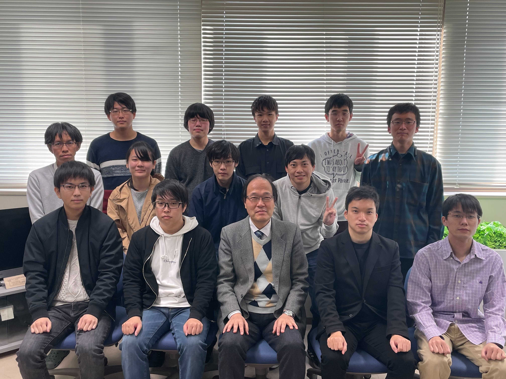
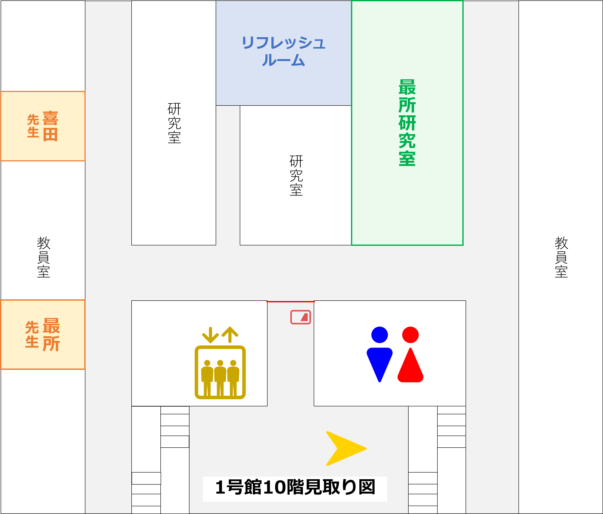
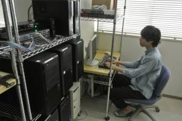

<nav role="navigation" class="contents_table">

### 目次

[最所研究室](#最所研究室)  
[ひとこと](#ひとこと)  

</nav>

# 最所研究室

<!--  -->

香川大学創造工学部 情報システム・セキュリティコース (旧:工学部 電子・情報工学科) 最所研究室です。  
場所は1号棟10F北側のオープンスペースです。  
計算機システム系の研究室です。  
現在では主に分散Webシステムやアクセス制御Webシステムの研究開発を行っています。  
詳しくはサイドメニューから [研究テーマ紹介](./wiki/theme.md)をご覧ください。  

最所先生のWebページは[こちら](http://www.eng.kagawa-u.ac.jp/~sai/)。  
香川大学によるStaff紹介ページは[こちら](https://www.kagawa-u.ac.jp/kagawa-u_ead/introduction/staff/20697/staff0127/)。  
研究室紹介のスライド資料は[こちら](public_material/Intro_Saisho-Lab2022.pdf)。  

研究室に御用がある方は、 [contact[at]air.eng.kagawa-u.ac.jp](mailto:contact@air.eng.kagawa-u.ac.jp) に([at]を@に変更して) 御連絡ください。  

<!--  -->

# ひとこと

新規配属者向けに研究室訪問を実施中です。  
詳細は[こちら](./wiki/assign.md)。

# メンテナンス情報

8/27~8/29にメンテナンスを行います．
アクセスできなくなるので，よろしくお願いします．

---

    
    

