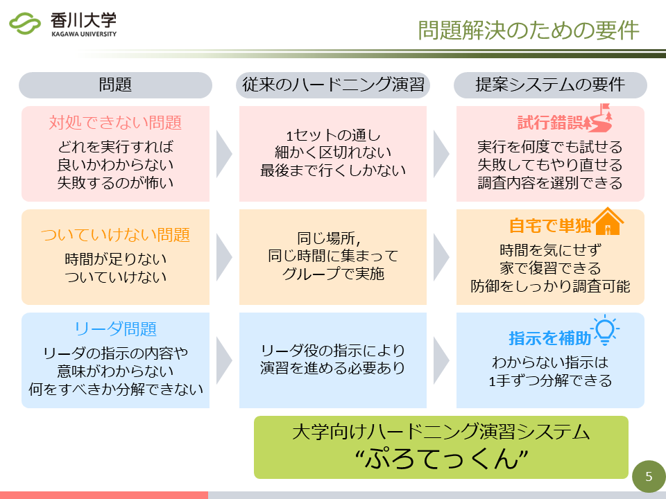
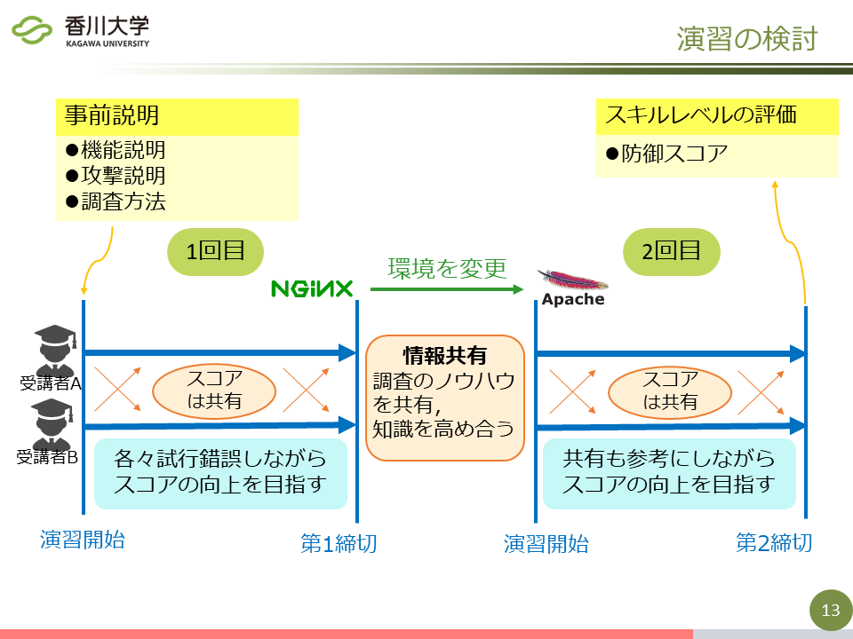

<nav role="navigation" class="contents_table">

### 目次

[研究テーマ](#研究テーマ)  
[クラウドに適した分散Webシステム](#クラウドに適した分散webシステム)  
[NAP-Webを用いた優先アクセス機構](#nap-webを用いた優先アクセス機構)  
[キャッシュサーバーを用いた分散Webシステム](#キャッシュサーバーを用いた分散webシステム)  
[ファイアウォールを用いたアクセス制御システム](#ファイアウォールを用いたアクセス制御システム)  
[分散WebシステムにおけるDNSを用いた負荷分散機構](#分散webシステムにおけるdnsを用いた負荷分散機構)  
[脆弱性情報などを利用した​セキュリティシステム](#脆弱性情報などを利用した​セキュリティシステム)  
[コンテナの隔離を強化するサンドボックス機構](#コンテナの隔離を強化するサンドボックス機構)  
[DNSサービス/DNSキャッシュポイズニング可視化システム](#dnsサービスdnsキャッシュポイズニング可視化システム)  
[試行錯誤しながら自学自習できる体験型セキュリティ演習システム](#試行錯誤しながら自学自習できる体験型セキュリティ演習システム)  
[最近までの研究](#最近までの研究)  
[機器情報を用いたネットワーク管理システム](#機器情報を用いたネットワーク管理システム)  
[リンク構造ファイルシステム](#リンク構造ファイルシステム)  

</nav>

# 研究テーマ

現在行われている研究や、以前行われていた研究の概要を解説しています。  
画像をクリックすると拡大表示されます。  
一部のスライドは [こちら](../static/index.md) で公開しています。   

## クラウドに適した分散Webシステム

クラウドとは、インターネットを介してどこからでも利用できるサービスのことです。  
このクラウド上に仮想のWebサーバを構築し、アクセスを分散させる方法があります。  
仮想サーバは簡単に構築・複製したり、起動・停止させることができるので、アクセス数に応じて必要な台数だけ用意し、コストを削減することができます。  

この研究では、Webサーバをどのように監視すれば良いか、アクセス数に対してどのようなアルゴリズムでサーバの台数を決めれば良いかを、実際にシステムを開発し、大量のサーバを使って実験しながら研究しています。   

## NAP-Webを用いた優先アクセス機構

NAP-Webは、Webページへのアクセスが混み合っている時に利用者に待ち時間を書いた仮想的な整理券を配布します。  
整理券を持って再度アクセスした利用者については、必ずアクセスを受け付けます。  

本研究ではNAP-Webに、特定のサーバとのアクセスを、アクセスが混み合っている場合でも一定以上確保するような機構の作成を目指しています。  
アルゴリズムを検討し開発と実験、評価を行っています。   

## キャッシュサーバーを用いた分散Webシステム

分散Webシステムとは、ユーザーからのアクセスを複数台用意したWebサーバーに分散させることで、オリジンサーバへの負担の軽減を目的とするシステムです。  

本研究では、Webサーバーのキャッシュ管理において、静的、動的コンテンツの両方のキャッシュを可能とした、負荷軽減の点において効率的なキャッシュの更新を目的とする機構の開発を行っています。  
まだ始まったばかりの研究で、現在はキャッシュ更新手法の検討や、システム開発に必要な機能を調べています。  

## ファイアウォールを用いたアクセス制御システム

Webを利用したサービスの中には、ある特定の対話的な処理を高い優先度で処理したいという要求があります。  
この時、サーバの過負荷によって、応答性の低下が問題になります。  
ユーザ認証などで、同時サービス数は減らせますが、DoS攻撃は防げません。  
この攻撃はファイアウォールによって防ぐことができます。  

そこで本研究では、安定して供給したいサービスに対して、ファイアウォールを利用してアクセス制御を行うシステムの開発をしています。  

## 分散WebシステムにおけるDNSを用いた負荷分散機構

近年、Webサービスの普及や利用者の増加に伴い、Webサーバが行う処理が複雑化し負荷が増加しています。  
Webサーバへの負荷の増加に対し、クラウドで提供されるサーバをキャッシュサーバとして用いて監視し、その負荷量に応じてキャッシュサーバ数を動的に増減させることでリソースとコストの最適化を行う分散Webシステムというものがあります。  

本研究では、DNSラウンドロビンというDNSの機能を利用した、分散Webシステムの負荷分散機構の開発を行っています。   

## 脆弱性情報などを利用した​セキュリティシステム

スライドを [こちら](../public_material/s20g470-IntroResearch.pdf) で公開しています．  

近年，脆弱性を利用した攻撃が増えており，それらの攻撃はパッチが配布されるまで対策が難しいです．  
また，大学などの組織のネットワークで「BYOD」を用いる組織も増えています．  
そのような組織において，情報資産が脅威にさらされており，パッチが導入されていない機器が組織に蔓延しているという課題があります．  
しかしながら，大学や中小企業の組織では，コスト面の問題から高性能かつ高価なセキュリティシステムの導入や，個人に対して機器の配布することなどが難しいです．  
これらを受けて，我々は，攻撃される可能性のある機器を，組織のネットワークから追い出すことで，組織の情報資産を守る，大学などを対象としたシステムを目指しています．  

方針を元にした課題の解決手法です．  
脆弱性を利用した攻撃に対しては，予め攻撃前に脆弱性の情報を収集しておくことで，対策が考えられます．  
パッチ配布に関しては，配布を待つことなく，先手を打っていきます．  
また，費用に関しては，現状のBYODに導入することで，高価な解決手法を用いません．  
それによって持ち込まれる不特定多数の機器は，エージェントを用いることで管理します．  
これらにより，組織に対してサイバー攻撃を受ける可能性のある機器をあぶり出します．  
最後に，攻撃から守るには，予め攻撃の可能性がある機器をネットワークから遮断します．   

## DNSサービス/DNSキャッシュポイズニング可視化システム

DNSを標的とした，あるいは利用した攻撃は数多く存在します．  
すでに対策は施されていますが，未だに新たな攻撃手法が出ていることも事実です．  
また，こういったサイバー攻撃は実際に目視できず，図表による説明でも通信の順番やデータなどの情報が分かりにくくなってしまいます．  
そこで，情報セキュリティ技術の導入教育を目的とした，DNS攻撃の中でも代表的なDNSキャッシュポイズニングを可視化するWebアプリケーションシステム，「Visual DNS Attack」を開発しました．  
これにより，利用者がポイズニングについてより理解すると同時に，DNSの構造的な弱点についても理解すると考えています．  

## 教育者の負担軽減に向けたセキュリティ演習環境の自動構築システムに関する研究

サイバー攻撃の多様化・高度化を受け，セキュリティ対策としてセキュリティ人材の育成が求められています.  
特に，実践的な技術力を身につけられる演習が注目されており，国の人材育成事業としても実施されています.  
しかし，演習を実現するための環境構築には専門技術や手間，時間が必要であり，一部の企業や教育機関にとどまっています.  
本研究では，演習環境を用意する教育者の負担を軽減し，幅広くセキュリティ演習が実施できるようになることを目指し，演習環境の自動構築システムを開発しています．  

## 試行錯誤しながら自学自習できる体験型セキュリティ演習システム

サイバー攻撃の増加，高度化に伴い，「手が動く」実践的なセキュリティ人材が不足しています．  
本研究では，「手が動く」セキュリティ人材を育成することを，目的としています．  
そのために，体験型セキュリティ演習の1つである「ハードニング演習」に注目しています．．  
しかし，既存のハードニング演習はグループでの活動となるため，演習中に置いてけぼりになり，演習の効果が得られていない(手を動かせていない)学生が一定数います．  
このような，学生をサポートし，底上げするシステムを開発することで，セキュリティ人材の育成に寄与します．   

# 最近までの研究

## 機器情報を用いたネットワーク管理システム

社内などのネットワークに接続する通信機器の情報収集を効率的に行い、管理者の負担を軽減することを目的としています。  
また、学内情報を保持する教務システムや機器情報を用いてネットワーク内のグループ化を可能とし、アクセス制御を自動化することで柔軟なネットワーク管理を実現できるよう開発を行なっています。   

## リンク構造ファイルシステム

ファイルに対して間違った操作や第三者による変更が加えられたときに変更前の状態に戻したいといった状況が考えられます。  
ファイルを可変長ブロックとそれらをつなぐリンクで構成し、ファイルの変更操作を上書きではなくリンクのつなぎかえによる追記で実現することで過去の状態を復元することができるファイルシステムを開発しています。  

## コンテナの隔離を強化するサンドボックス機構

軽量な仮想化手法として，コンテナ型仮想化が注目されています。  
昨今では、DockerやKubernetesといったコンテナ型仮想環境を用いてWebサービスを提供するサービスが増加しています。  
しかし、コンテナはホストOSとカーネルを共有しているため、コンテナ内から物理マシンやホストOSへ攻撃されてしまうリスクが存在します。  
近年、コンテナ内からカーネルやシステムコールの脆弱性を利用し，ホストへの不正な攻撃 (権限昇格)が可能となってしまうコンテナランタイム(コンテナ実行環境)の脆弱性も報告されています。  
本研究では、権限昇格に対し，User-Mode Linuxを用いた強力な分離機構を強化するコンテナランタイムとしてTight-Containers の設計と実装を行います。  
