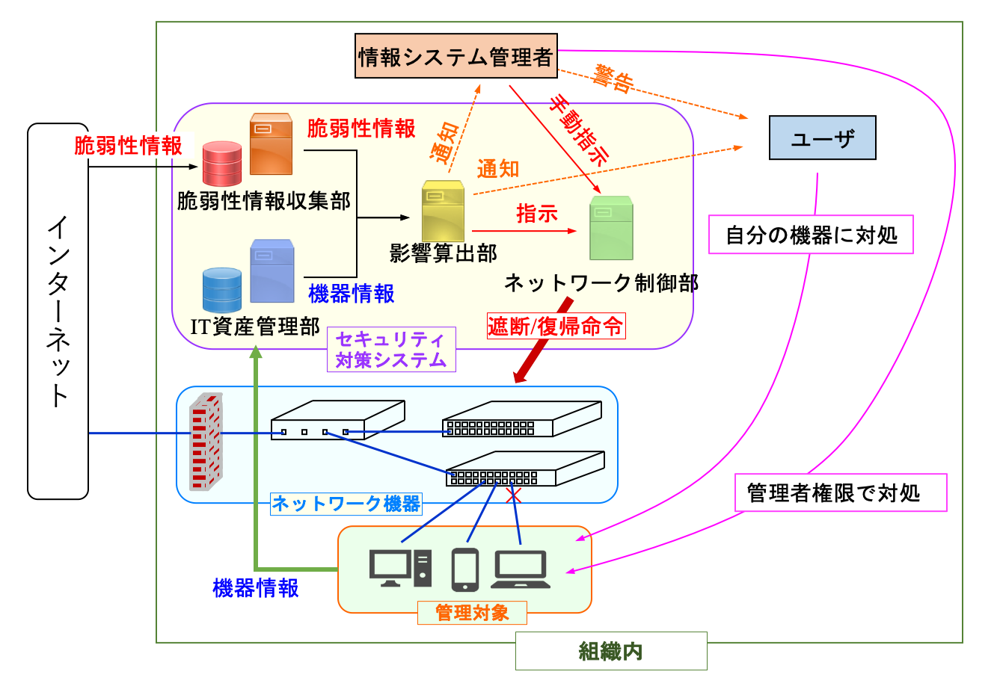
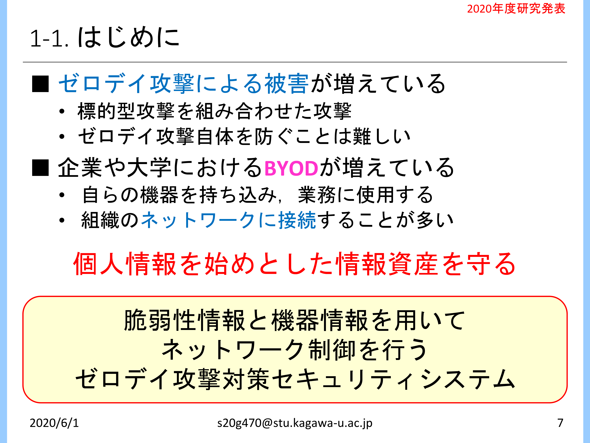
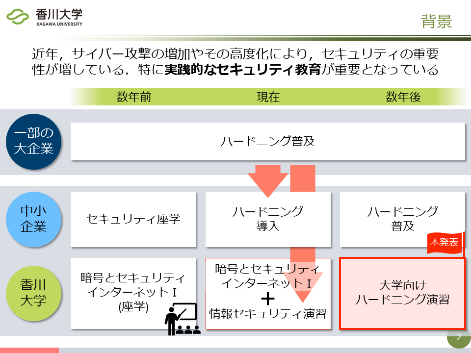
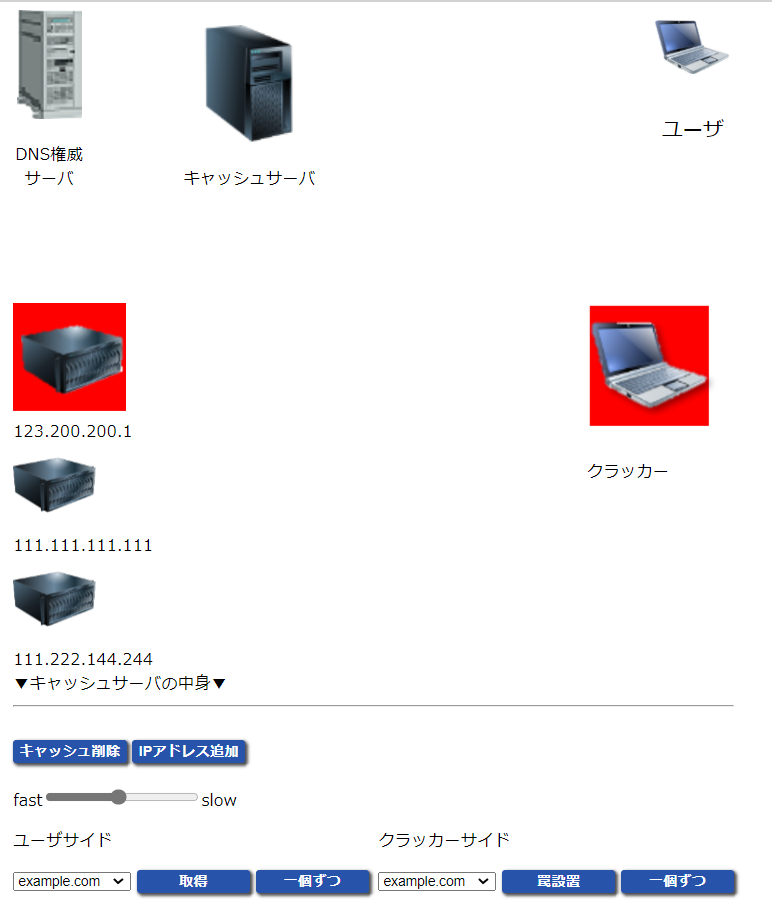
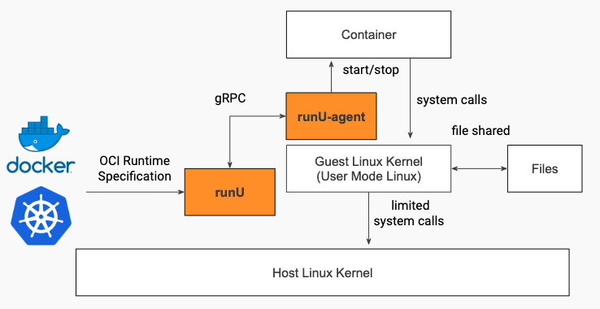

<nav role="navigation" class="contents_table">

### 目次

[研究テーマ](#研究テーマ)  
[負荷分散Webシステム](#負荷分散webシステム)  
[クラウドに適した分散Webシステム](#クラウドに適した分散webシステム)  
[分散Webシステムにおけるオートスケーリング機能](#分散Webシステムにおけるオートスケーリング機能)  
[分散WebシステムにおけるDNSを用いた負荷分散機構](#分散webシステムにおけるdnsを用いた負荷分散機構)  
[セキュリティ保護システム](#セキュリティ保護システム)  
[BEYOND:脆弱性対策のための​セキュリティ保護システム](#beyond脆弱性対策のための​セキュリティ保護システム)  
[セキュリティ演習システム(Security Education System)](#セキュリティ演習システム)  
[教育者の負担軽減に向けたセキュリティ演習環境の自動構築システム(Automatic Construction System for Security Training Environment to Reduce the Burden on Educators)](#教育者の負担軽減に向けたセキュリティ演習環境の自動構築システム)  
[試行錯誤しながら自学自習できる体験型セキュリティ演習システム(Security Practice System Enabling Trial and Error)](#試行錯誤しながら自学自習できる体験型セキュリティ演習システム)  
[ファイルシステム](#ファイルシステム)  
[バージョン管理機能を持ったファイルシステム](#バージョン管理機能を持ったファイルシステム)
[最近までの研究](#最近までの研究)  
[DNSサービス/DNSキャッシュポイズニング可視化システム](#dnsサービスdnsキャッシュポイズニング可視化システム)  
[機器情報を用いたネットワーク管理システム](#機器情報を用いたネットワーク管理システム)  
[リンク構造ファイルシステム](#リンク構造ファイルシステム)  
[NAP-Webを用いた優先アクセス機構](#nap-webを用いた優先アクセス機構)  
[ファイアウォールを用いたアクセス制御システム](#ファイアウォールを用いたアクセス制御システム)  
[コンテナの隔離を強化するサンドボックス機構](#コンテナの隔離を強化するサンドボックス機構)  

</nav>

# 研究テーマ

最所研究室では現在、分散Webシステムやセキュリティの強化に関する研究を行っています。  
これらは、「快適かつ安全にコンピュータを使う」ための技術です。  
過去には、ネットワーク機器管理システムやアクセス制御システムに関する研究も行っていました。  

共同研究としては、同コースの [喜田研究室](http://sleepingbeauty.eng.kagawa-u.ac.jp/) とセキュリティに関する研究や、亀井研究室とストレージに関する研究を行っています。  

なお、これらの研究テーマにとらわれずに自分でテーマを設定して研究を行いたい方も歓迎します。  
並列/分散システム、クライアントサーバシステム、オペレーティングシステム、フォールトトレラント、ゼロデイ攻撃、Container、Virtualization、などが当研究室のキーワードです。  
詳しいことについては研究室まで足をお運び下さい。  

現在行われている研究や、以前行われていた研究の概要を解説しています。  
画像をクリックすると拡大表示されます。  
一部のスライドは [こちら](../static/index.md) で公開しています。  

## 負荷分散Webシステム

分散Webシステム、オートスケール、負荷分散、仮想化技術

### クラウドに適した分散Webシステム

クラウドとは、インターネットを介してどこからでも利用できるサービスのことです。  
このクラウド上に仮想のWebサーバを構築し、アクセスを分散させる方法があります。  
仮想サーバは簡単に構築・複製したり、起動・停止させることができるので、アクセス数に応じて必要な台数だけ用意し、コストを削減することができます。  

この研究では、Webサーバをどのように監視すれば良いか、アクセス数に対してどのようなアルゴリズムでサーバの台数を決めれば良いかを、実際にシステムを開発し、大量のサーバを使って実験しながら研究しています。     

### 分散Webシステムにおけるオートスケーリング機能

近年Webサービスの普及や利用者の増加によるアクセス数の増加に伴い、Webサーバへの過負荷が問題となっています。  
先行研究では、複数台の仮想マシン上でWebサーバ(キャッシュサーバ)を用意し、処理を分散させることで応答性を確保した分散Webシステムを開発していましたが、仮想マシンでは起動や停止に係る負荷が大きく、クラウド環境では余計なコストがかかります。  
そこで本研究では、仮想マシンと比較して負荷の少ないコンテナ技術を用いて、低コストなWebサーバの割り当てを目的としています。  
さらにアクセス数の変化に追従して必要最小限のコンテナを割り当てるオートスケール機能を開発することで、分散Webシステムの運用におけるコストを最小限に留めます。  

### 分散WebシステムにおけるDNSを用いた負荷分散機構

近年、Webサービスの普及や利用者の増加に伴い、Webサーバが行う処理が複雑化し負荷が増加しています。  
Webサーバへの負荷の増加に対し、クラウドで提供されるサーバをキャッシュサーバとして用いて監視し、その負荷量に応じてキャッシュサーバ数を動的に増減させることでリソースとコストの最適化を行う分散Webシステムというものがあります。  

本研究では、DNSラウンドロビンというDNSの機能を利用した、分散Webシステムの負荷分散機構の開発を行っています。   

## セキュリティ保護システム

情報セキュリティ，脆弱性，BYOD，標的型攻撃，ゼロデイ攻撃

### BEYOND:脆弱性対策のための​セキュリティ保護システム

スライドを [こちら](../public_material/s20g470-IntroResearch.pdf) で公開しています．  

<!--  -->
<!--  -->
<!--  -->

近年，脆弱性を利用した攻撃が増えており，それらの攻撃はパッチが配布されるまで対策が難しいです．  
また，個人で保有する機器を大学などの組織内のネットワークに持ち込む「BYOD」を導入する組織も増えています．  
そのような組織において，パッチが導入されていない機器が組織に蔓延しており，情報資産が驚異にさらされているという課題があります．  
しかしながら，大学や中小企業などの組織では，コストの問題から高性能かつ高価なセキュリティシステムの導入や，個人に対して機器の配布をすることなどが難しいです．  
これらを受けて，我々は，攻撃される可能性のある機器を，組織のネットワークから追い出すことで，組織の情報資産を守る，セキュリティ保護システム ”BEYOND” を開発しています．  

”BEYOND”はインターネット上に公開されている脆弱性情報を収集します．  
組織内の機器情報はエージェントやブラウザからの入力により収集・管理します．  
これらの情報を突き合わせ，組織内の機器に存在する脆弱性を検知し，機器に対する制御方針を算出します．  
算出された制御方針を元に組織の管理者及び機器の所有者に通知を行い，システムにより機器を組織のネットワークから遮断・隔離を行います．  

## セキュリティ演習システム

**Security Education System** 

セキュリティ教育，可視化，DNS，軽量仮想環境，試行錯誤

Security Education, Visualization, Domain Name System(DNS), Lightweight Virtualization, Trial and Error

### 教育者の負担軽減に向けたセキュリティ演習環境の自動構築システム

**Automatic Construction System for Security Training Environment to Reduce the Burden on Educators)**

<!--  -->
<!--  -->

サイバー攻撃の多様化・高度化を受け，セキュリティ対策としてセキュリティ人材の育成が求められています.  
特に，実践的な技術力を身につけられる演習が注目されており，国の人材育成事業としても実施されています.  
しかし，演習を実現するための環境構築には専門技術や手間，時間が必要であり，中小企業や地方の教育機関の教育者には困難です.  
本研究では，演習環境を用意する教育者の負担を軽減し，幅広くセキュリティ演習が実施できるようになることを目指し，演習環境の自動構築システムを開発しています．  

In recent years, with the diversification and sophistication of cyber-attacks, the development of security personnel is required as a security countermeasure.  
In particular, practice that enable students to acquire practical technical skills are attracting attention, and are being implemented as part of a national human resource development project.  
However, building an environment to implement practice requires specialized skills, labor, and time, making it difficult for educators at small and medium-sized enterprises and local educational institutions.  
In this research, we are developing an automatic construction system for the practice environment, aiming to reduce the burden on the educator who prepares the practice environment and to enable a wide range of security practiess.  

### 試行錯誤しながら自学自習できる体験型セキュリティ演習システム

**Security Practice System Enabling Trial and Error**
<!-- markdown-link-check-disable --> 
オープンキャンパスにも使用したポスターを [こちら](../static/index.html?FILE=../public_material/poster-2022_CyberEducation.pdf) で公開しています．  
The posters used by open campus are published [here](../static/index.html?FILE=../public_material/Security_Exercise_System.pdf) .  

修論発表に使用したスライドを [こちら](../static/index.html?FILE=../public_material/s22d451-IntroResearch.pdf) で公開しています．  
The slides used by Master's thesis presentation are published [here](../static/index.html?FILE=../public_material/s22d451-IntroResearch.pdf) (Only Japanese) .
<!-- markdown-link-check-enable --> 

サイバー攻撃の増加や高度化に伴い，「手が動く」実践的なセキュリティ人材が不足しています．  
本研究では，そのような人材の育成を目的として，体験型セキュリティ演習の1つである「ハードニング演習」に注目しています．  
しかし，既存のハードニング演習は，複数メンバー集まってグループで相談しながら行う演習であるため，スキルの低いメンバーは演習について行けずグループの中で置いてけぼりになってしまいます．  
このような，ついて行けない学生をサポートし，グループ演習ができるまでに底上げするシステムを開発することで，セキュリティ人材の育成に寄与します．  

With the increase and sophistication of cyber-attacks, there is a shortage of practical security personnel who are "hands-on".  
In this research, for the purpose of developing such human resources, we focus on "Hardening Practice", which is one of the hands-on security practices.  
However, since the existing "hardening practice" is an practice in which multiple members gather and consult in a group, members with low skills cannot keep up with the practice and are left behind in the group.  
We will contribute to the development of security human resources by developing a system that supports such students who cannot keep up and raises the level to the point where group practies can be done.  

## ファイルシステム

ファイルシステム開発，バージョン管理

### バージョン管理機能を持ったファイルシステム　

近年，ランサムウェアによる被害の件数は増加しています．  
重要なファイルを持つパソコンがランサムウェアに感染し，ファイルが暗号化された場合，業務の継続が困難になり多額の損害が生じます．  
通常は，バックアップを取りデータの消失に対応するのですが，バックアップのコストは高く，1日に1回です．  
そのため，バックアップを取ってから編集したファイルがランサムウェアによって暗号化された場合，そのファイルの編集内容を復元させることは難しいです．  
本研究では，ファイルのOPEN毎に自動でバージョン作成を行い，過去のファイルの状態に戻れるファイルシステムを開発をしています．  

# 最近までの研究

### DNSサービス/DNSキャッシュポイズニング可視化システム

DNSを標的とした，あるいは利用した攻撃は数多く存在します．  
すでに対策は施されていますが，未だに新たな攻撃手法が出ていることも事実です．  
また，こういったサイバー攻撃は実際に目視できず，図表による説明でも通信の順番やデータなどの情報が分かりにくくなってしまいます．  
そこで，情報セキュリティ技術の導入教育を目的とした，DNS攻撃の中でも代表的なDNSキャッシュポイズニングを可視化するWebアプリケーションシステム，「[Visual DNS Attack](https://github.com/sai-lab/Visual-DNS-Attack)」を開発しました．  
これにより，利用者がポイズニングについてより理解すると同時に，DNSの構造的な弱点についても理解すると考えています．  

## 機器情報を用いたネットワーク管理システム

社内などのネットワークに接続する通信機器の情報収集を効率的に行い、管理者の負担を軽減することを目的としています。  
また、学内情報を保持する教務システムや機器情報を用いてネットワーク内のグループ化を可能とし、アクセス制御を自動化することで柔軟なネットワーク管理を実現できるよう開発を行なっています。   

## リンク構造ファイルシステム

ファイルに対して間違った操作や第三者による変更が加えられたときに変更前の状態に戻したいといった状況が考えられます。  
ファイルを可変長ブロックとそれらをつなぐリンクで構成し、ファイルの変更操作を上書きではなくリンクのつなぎかえによる追記で実現することで過去の状態を復元することができるファイルシステムを開発しています。  

## NAP-Webを用いた優先アクセス機構

NAP-Webは、Webページへのアクセスが混み合っている時に利用者に待ち時間を書いた仮想的な整理券を配布します。  
整理券を持って再度アクセスした利用者については、必ずアクセスを受け付けます。  

本研究ではNAP-Webに、特定のサーバとのアクセスを、アクセスが混み合っている場合でも一定以上確保するような機構の作成を目指しています。  
アルゴリズムを検討し開発と実験、評価を行っています。 

## ファイアウォールを用いたアクセス制御システム

Webを利用したサービスの中には、ある特定の対話的な処理を高い優先度で処理したいという要求があります。  
この時、サーバの過負荷によって、応答性の低下が問題になります。  
ユーザ認証などで、同時サービス数は減らせますが、DoS攻撃は防げません。  
この攻撃はファイアウォールによって防ぐことができます。  

そこで本研究では、安定して供給したいサービスに対して、ファイアウォールを利用してアクセス制御を行うシステムの開発をしています。  

## コンテナの隔離を強化するサンドボックス機構

軽量な仮想化手法として，コンテナ型仮想化が注目されています。  
昨今では、DockerやKubernetesといったコンテナ型仮想環境を用いてWebサービスを提供するサービスが増加しています。  
しかし、コンテナはホストOSとカーネルを共有しているため、コンテナ内から物理マシンやホストOSへ攻撃されてしまうリスクが存在します。  
近年、コンテナ内からカーネルやシステムコールの脆弱性を利用し，ホストへの不正な攻撃 (権限昇格)が可能となってしまうコンテナランタイム(コンテナ実行環境)の脆弱性も報告されています。  
本研究では、権限昇格に対し，User-Mode Linuxを用いた強力な分離機構を強化するコンテナランタイムとしてTight-Containers の設計と実装を行います。  
